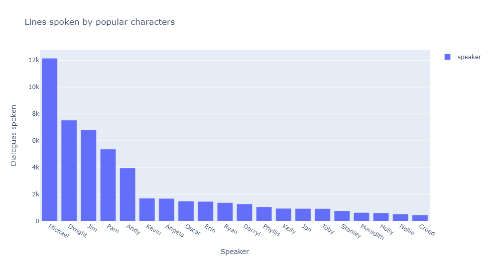
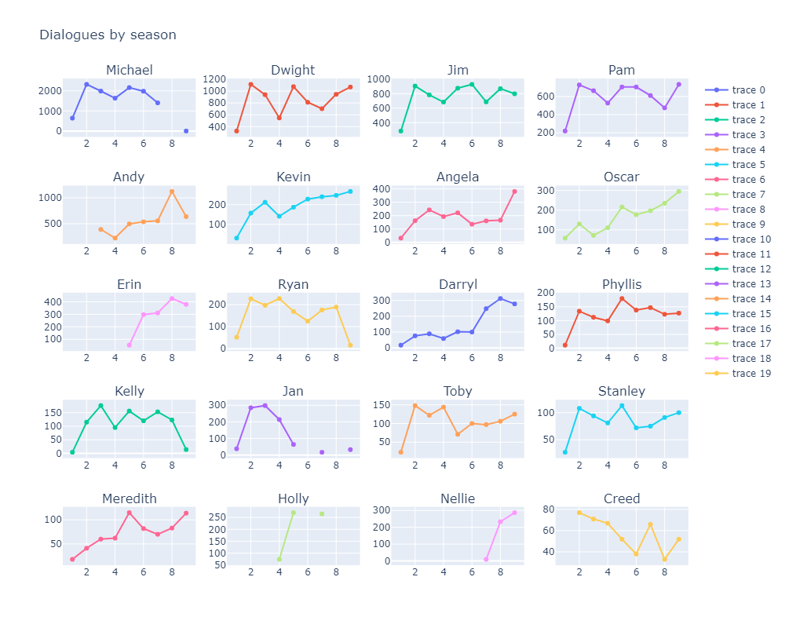
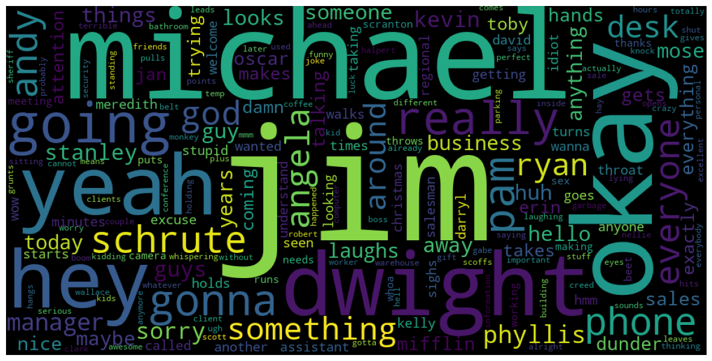
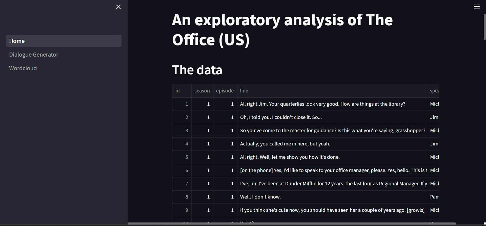
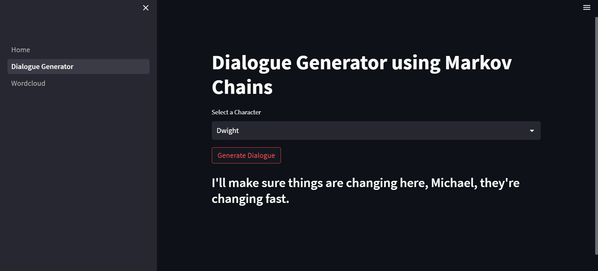

# "That's what she said!" - The Office Script Analysis
### Luuk Boekestein, Shantanu Motiani and Eline Westerbeek, 

---

## Abstract

---

In this project, we aim to analyze the scripts of the hit TV show ‘The Office’. We will be using a dataset from Kaggle, which contains the season, episode, scene, line of dialogue, the speaker  and whether the scene was deleted or not. Our goals include training a model to predict which character is the speaker, exploring interactions between characters, performing a sentiment analysis and doing topic modelling. Through this, we want to determine if there are certain topics that certain characters tend to talk about (which we can express using word clouds) and identify the main topics of different episodes/seasons. We think this is interesting because these characters are so iconic, and we want to explore whether we can find out what sets them apart and makes them unique. All three of us are big Office fans, so extracting underlying patterns in these scripts is really interesting to us!

## Research Questions

---

- Can we predict which character in the Office says which line of dialogue?
- What are the interactions between characters throughout the seasons?
- Sentiment analysis – What are the sentiments expressed in the dialogues, and how do they vary per character and season?
- Topic modelling – Are there certain topics that certain characters tend to talk about? And can we identify the primary topics of an episode? (We want to create word clouds to visualize this)
- *Possible extra*: generate quote from each character

## Dataset

---

For this project, we used a dataset that we found on Kaggle.com, containing all the scripts of the American TV series "The Office". It contains the season, episode, scene, line of dialogue, the speaker  and whether the scene was deleted or not. The dataset can be found [here](https://www.kaggle.com/datasets/lillitarhea/the-office-script-lines).

To process, we will employ various preprocessing techniques discussed throughout the course, such as dealing with punctuation, stopwords, lowercasing, tokenization, lemmatization, etc. The data size is sufficiently big, containing almost 60,000 rows (lines), with 7 columns indicating season, episode, scene, speaker, line, deleted and episode name. The dataset is in a .csv format.

A simple overview of the dataset using `ProfileReport` from `ydata_profiling` can be found in the [data_report.html](data_report.html) file.

## Milestones

---

### Planning

| Date | Milestone goal | Formal deadlines |
| --- | --- | --- |
| 19/04 | Finish and submit a project proposal | Project proposal | 
| 02/05 | Submit project update 1 | Project update 1
| 15/05 | Submit project update 2| Project update 2
| 30/05 | Make presentation | Presentation
| 02/06 | Submit final project | Final project

### Goals Project update 1

TODO:
- **Annotating dataset** Each manually annotate 100 lines of dialogue for sentiment analysis
    - Make sample [Luuk]
    - Annotate sample [All]
- **Preprocessing** Finding most effective pre-processing pipeline for sentiment analysis [Luuk]
- **Visualizations** Basic visualizations and analyis of the data [Shantanu]
- **Topic modeling** Explore topic modeling and zero-shot classification [Eline]

## Initial analysis of the data and visualizations

We started off by importing the dataset into a pandas DataFrame and dropping the 'scene' column. We sorted the characters by dialogues spoken and picked the top 20 for our basic analytics. Among those, Michael spoke the most dialogues (as expected) at 12,145 and Creed spoke 456. 

We also made a lineplot for the number of dialogues they spoke broken down by season to show the trends in a character's relative relevance across the show.

Next, we defined a function that takes a character and plots a wordcloud for them by making a collection of the most frequent words spoken that are not stopwords or common english words. We used the wordcloud library (https://pypi.org/project/wordcloud/) for the same. 

Here are the most frequently spoken words by Dwight:

Fun Fact? Dwight might be the only character who takes his own name so often.  

## Annotating dataset by sentiment

To test the accuracy of our sentiment analysis, we each manually annotated 100 lines of dialogue for sentiment (either -1, 0 or 1). For this, we made 3 samples of 100 lines each, and each of us annotated one sample. The code that was used to create the samples is in [this notebook](annotated_data/make_samples.ipynb). We saved the samples to CSV and then annotated them using a short function that we wrote in [this notebook](annotated_data/annotate.ipynb). The annotated data was then saved in 3 different CSV files, which can be found in the [annotated_data](annotated_data) folder.

## Preprocessing/sentiment analysis

To find the optimal preprocessing pipeline and model for sentiment analysis, we tried out different methods and compared their accuracy. The code for this can be found in [this notebook](sentiment_analysis/notebook_luuk.ipynb). We then tested all the different combinations on the annotated data, and compared their accuracy. The models we tested are:

- Roberta large [siebert/sentiment-roberta-large-english](https://huggingface.co/siebert/sentiment-roberta-large-english)
- BERT [sbcBI/sentiment_analysis_model](https://huggingface.co/sbcBI/sentiment_analysis_model)
- Distilbert [distilbert-base-uncased-finetuned-sst-2-english](https://huggingface.co/distilbert-base-uncased-finetuned-sst-2-english)
- Bert uncased [Seethal/sentiment_analysis_generic_dataset](https://huggingface.co/Seethal/sentiment_analysis_generic_dataset)

The different preprocessing pipelines we used are mostly related to dealing with descriptions in the lines, like [to camera] or [laughing]. From the testing we found that simply removing them resulted in the best accuracy. The results in detail can be found in the notebook, but are summarized here:

| Model | Preprocessing | Accuracy | Precision | MSE |
| --- | --- | --- | --- | --- |
| Roberta large | Remove descriptions | 0.67 | 0.69 | 1.29 |
| Roberta large | Keep descriptions | 0.65 | 0.67 | 1.36 |
| Bert uncased | Remove descriptions | 0.63 | 0.63 | 0.46 |
| Bert uncased | Keep descriptions | 0.62 | 0.63 | 0.47 |
| BERT | Remove descriptions | 0.54 | 0.54 | 0.65 |
| BERT | Keep descriptions | 0.55 | 0.55 | 0.66 |
| Distilbert | Remove descriptions | 0.41 | 0.27 | 0.89 |
| Distilbert | Keep descriptions | 0.42 | 0.28 | 0.85 |

We find that Roberta Large and Bert uncased perform best, with Roberta Large being more accurate. However, Bert uncased has a lower MSE, meaning that it is more confident in its predictions. For now we used Bert uncased for our sentiment analysis, also because it is faster to train and use. Finally we applied the model to the complete dataset. The full dataset, annotated for sentiment, can be found [here](sentiment_analysis/Sentiment_labeled_data.csv)

## Topic modeling
First, I explored and implemented a variety of preprocessing functions. I tried creating multiple topic models, identified areas of improvement in terms of preprocessing and adapted as needed. These preprocessing techniques include things like lemmatization, removing stopwords/most common words, removing names of characters, removing punctuation, etc. I also implemented things like grouping the text by scene and by episode. Since the average line of dialogue was so short, I have been doing topic modelling by scene, but for the next update it could be interesting to explore by episode as well.

For the actual topic modelling, two models were implemented: NMF and LDA. For NMF, I created functions which calculated and plotted the coherence value and reconstruction error for a variety of numbers of topics, so that I could identify the ideal choice. Similarily, for LDA I had a function that did the same, except it did it for coherence, log-likelihood and perplexity. So far, NMF seems to produce more coherent topics, and I have started to see some interesting clusters, for instance:

- Topic 0: friendship and fun
great thanks sound laugh tonight place night everybody question friend movie coming listen happy guess stuff talking wanted today salesman
- Topic 1: phone calls with clients and messages
phone hello client answer calling listen imitating sound transfer voice ringing month howard second later whisper meeting idiot saying message
- Topic 2: ??
thing talking everybody saying listen wanted business start believe night guess money called getting meeting totally trying stuff place better
- Topic 3: conferences, meetings and other office/business activities
office raise everybody manager today place camera deangelo talking start conference hello think second leave looking holly friend people meeting
- Topic 4: friendship and its emotions
sorry laugh friend second hello manager voice night better trying thanks wanted funny pretty getting minute stupid guess probably laughing
- Topic 5: the company (which is called dunder mifflin, a paper company in scranton)
paper dunder mifflin company business scranton manager hello client start today question talking branch salesman people better second dollar money
- Topic 6: the office parties (often during christmas and birthdays -- thrown by the party planning committee)
party christmas start everybody holly committee throw planning break coming birthday question wanted pizza tonight friend starting important night laugh
- Topic 7: crazy scenarios (like prison mike)??
point woman prison coming crazy check today better stuff friend pretty question probably thanks break meeting people wrong mouth laughter

Then, I also wanted to try zero-shot topic classification, which is a technique where you can input your own topics/categories into the model, and it classifies the text without labelled data. I think this could be a really interesting way to check whether the labels we give to the LDA/NMF topic models correspond well. (so we could check if the zero-shot label == LDA/NMF cluster label) I tried this out with some categories I came up with (not based on LDA/NMF right now, and plotted some word cloud for different topics)

## A Dialogue Generator based on Markov Chains

## A Web-App that hosts our project for users to interact with the data

We created an interactive web app that hosts our project. It allows the users to interact with the data and the models deployed. Specific pages and nuances of the app are described in this section below. The app is created using a python framework called streamlit (https://streamlit.io/). To host the app yourself, clone the repository to your local system and run the following command:
	
	streamlit run .\app\Home.py

Note that for the app to run as expected, you would have to install the following dependencies:
	
	pip install streamlit
	pip install markovify
	pip install plotly
	pip install wordcloud

Currently, the app contains a home page, a wordcloud generator, and a random dialogue generator. 

### Home page
The home page shows a the preliminary analysis of the data mentioned in [Initial analysis of the data and visualizations](#Initial-analysis-of-the-data-and-visualizations). 

### Dialogue Generator page
This page hosts the dialogue generator described in [A Dialogue Generator based on Markov Chains](#A-Dialogue-Generator-based-on-Markov-Chains)

It allows the user to select a character from the drop-down menu and runs the dialogue generator model. The app caches the data for a particular character when run for the first time so it doesn't have to train the model again when run for the same character. 

### Wordcloud Generator

This page hosts the code for generating a wordcloud of the most spoken words by a character as described in [Initial analysis of the data and visualizations](#Initial-analysis-of-the-data-and-visualizations).

Users can select a character from the drop-down menu and the app caches the model so it can be loaded faster when called again. 

## Goals Project update 2 (To be specified)

- Sentiment analysis
    - lexicon-based
    - ML-based
- Topic modelling
    - try grouping per episode
    - finish general
    - see which characters dominate which topics (can make some wordclouds!!)
    - see which topics dominate various episode (can plot them!!)
    - Wordclouds per topic!

## Documentation

---

- *TBA* 
